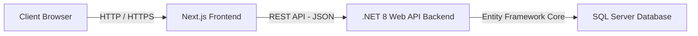

# ArtLab - Kiến Trúc Dự Án (Project Architecture)

Dự án ArtLab sử dụng **Kiến trúc Phân tách Độc lập (Decoupled Architecture)**. Hệ thống chia làm hai phần chính chạy trên các server (hoặc service) riêng biệt để tăng khả năng mở rộng (scalability), dễ bảo trì và phân định rõ ràng trách nhiệm.

## 1. Tổng quan Kiến trúc

### Tại sao lại là Decoupled?
- **Độc lập triển khai:** Có thể cập nhật Frontend mà không cần restart Backend và ngược lại.
- **Tính chuyên biệt:** Next.js sẽ chuyên lo về UI, SEO, Animation. Backend sẽ chuyên lo về bảo mật, xử lý thanh toán, logic phân quyền.
- **Tương lai:** Dễ dàng phát triển thêm Mobile App (Flutter/React Native) vì Backend đã là REST API độc lập.

---

## 2. Frontend (Next.js 14+ App Router)

- **Ngôn ngữ & Cốt lõi:** TypeScript, React.js.
- **Routing:** App Router (`app/`). Sử dụng triệt để Server Components để giảm tải dung lượng Javascript phía client.
- **Styling:** CSS thuần (Vanilla CSS) và CSS Modules để kiểm soát pixel-perfect các hiệu ứng gradient, shadow, glassmorphism theo phong cách Cinematic.
- **Quản lý State:** Zustand (dành cho client-side state như giỏ hàng, user session cache).
- **Fetch Data:** React Server Components (RSC) kết hợp `fetch` API nguyên bản của Next.js để caching.

---

## 3. Backend (.NET 8 C# Web API)

Áp dụng mô hình **N-Tier (Clean Architecture rút gọn)** giúp code không bị rối khi dự án lớn lên.

### Cấu trúc Layer:
1. **API Layer (`Controllers`):**
   - Chỉ chịu trách nhiệm tiếp nhận HTTP Request, validate cơ bản (Model State) và trả về HTTP Response (200 OK, 400 Bad Request,...).
2. **Business Logic Layer (`Services`):**
   - Chứa toàn bộ "não" của ứng dụng. Ví dụ: logic kiểm tra mua khóa học, gen JWT Token, gửi email.
   - Thao tác thông qua Interface (`IUserService`, `ICourseService`) để dễ dàng viết Unit Test và sử dụng DI (Dependency Injection).
3. **Data Access Layer (`Repositories` & Entity Framework):**
   - Giao tiếp với Database. Định nghĩa các Models/Entities. 

### Bảo mật (Security):
- **Authentication:** JSON Web Token (JWT).
- **Password Hashing:** `BCrypt.Net`.
- **CORS:** Cấu hình nghiêm ngặt chỉ cho phép domain của Next.js được phép gọi API.

---

## 4. Tích hợp Bên thứ ba (Third-party Services)

- **Video Streaming & Bảo vệ Bản quyền:** VdoCipher. Video được host tại VdoCipher và mã hóa bằng DRM (Widevine/FairPlay). Backend chỉ lưu trữ `VideoId` và gọi API của VdoCipher để lấy `OTP` cho phép Frontend phát video. Trang học overlay **watermark** (email + user id từ JWT + thời gian) để hỗ trợ truy vết; **không** cam kết chặn hoàn toàn quay màn hình / Discord — xem [CONTENT_PROTECTION_OTT.md](CONTENT_PROTECTION_OTT.md).
- **Database:** Microsoft SQL Server (hoặc PostgreSQL tùy môi trường).
